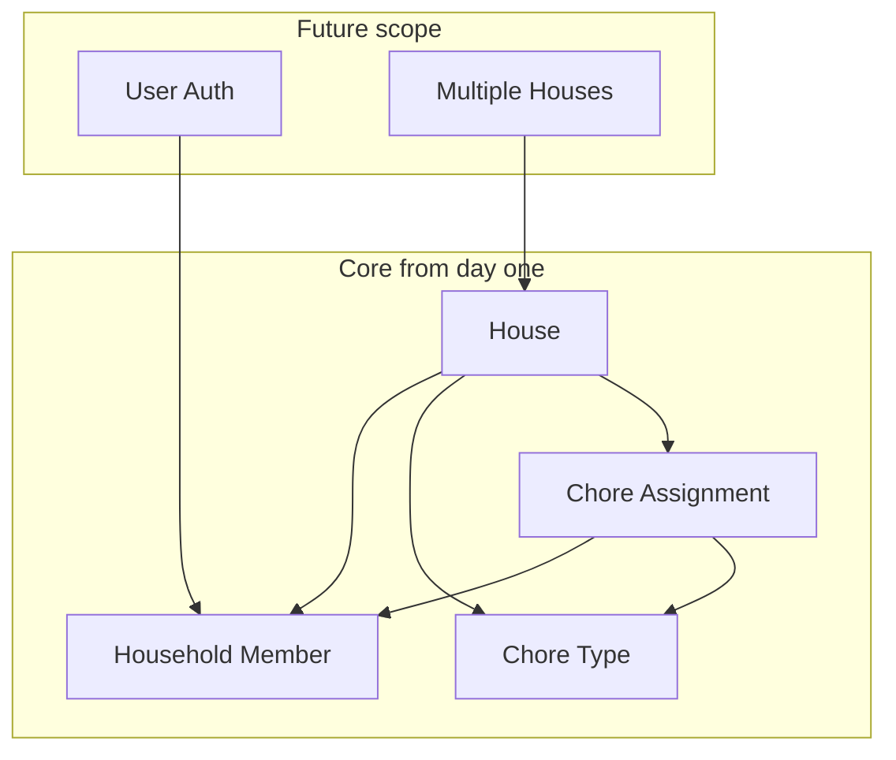

# Household Chore Tracker — Scalable Build Plan

## Goals

- **MVP:** Track who is responsible for which chore (garbage, recycling, snow shoveling, etc.) with simple rotation or assignment.
- **Later:** User authentication and multiple, separated house groups without reworking the core design.

---

## 1. Architecture Overview

Design the app so that **houses** and **users** exist in the model from the start, even if the first version has no login and only one “house.”




**Principles:**

- **Multi-tenant by design:** All chore data is scoped to a `house_id`. No global “current user” state in the data layer—always pass house context.
- **Auth-ready:** Model includes a `User` (or equivalent) and links it to `HouseholdMember` so you can add login later without changing the chore/assignment schema.
- **Single codebase, phased features:** One repo with feature flags or environment-based toggles for auth and multi-house UI.

---

## 2. Data Model (Database)

Use a relational DB (e.g. **PostgreSQL** or **SQLite** for dev). Schema should support one or many houses and future auth.


| Entity              | Purpose                                       | Key fields (conceptual)                                                                           |
| ------------------- | --------------------------------------------- | ------------------------------------------------------------------------------------------------- |
| **House**           | One household / shared living group           | `id`, `name`, `created_at`                                                                        |
| **ChoreType**       | Kind of chore (e.g. garbage, recycling, snow) | `id`, `house_id`, `name`, `rotation_order` (optional)                                             |
| **HouseholdMember** | Person in a house (later linked to User)      | `id`, `house_id`, `display_name`, `user_id` (nullable until auth)                                 |
| **ChoreAssignment** | Who does what and when                        | `id`, `house_id`, `chore_type_id`, `member_id`, `due_date` or `period`, `completed_at` (optional) |


- Every table that represents “house data” has `house_id` (or equivalent) for scoping.
- Indexes on `house_id` (and `user_id` when you add it) so queries stay fast as you add houses and users.

Optional: a **RotationRule** or **Schedule** table later (e.g. “garbage every Monday, rotate among members”) so the app can auto-suggest or create assignments.

---

## 3. Suggested Tech Stack

- **Backend:** Node.js (Express or Fastify) or Next.js API routes — simple REST or tRPC.
- **Database:** PostgreSQL (production) and SQLite or Pg in Docker for local dev. Use an ORM (e.g. **Drizzle**, **Prisma**) for migrations and type-safe access.
- **Frontend:** React (e.g. **Next.js** or **Vite + React**) with a small state layer (React Query for server state, optional Zustand for UI state).
- **Hosting (later):** Vercel/Railway/Fly.io for app + managed Postgres; or Docker Compose for self-host.

This stack is common, well-documented, and scales to many houses and users.

---

## 4. Repository and Module Layout

Keep backend and frontend in one repo (monorepo) or separate repos; one repo is enough for a small team.

```
Our_Turn/
├── package.json
├── README.md
├── .env.example
├── backend/                 # or api/ if using Next.js API routes
│   ├── src/
│   │   ├── db/              # schema, migrations, client
│   │   ├── routes/          # house, chore-types, members, assignments
│   │   ├── services/        # business logic (rotation, next assignee)
│   │   └── middleware/      # optional: auth, house context
│   └── package.json
├── frontend/
│   ├── src/
│   │   ├── components/      # ChoreCard, MemberList, HousePicker (later)
│   │   ├── pages/           # Home, Chores, History (optional)
│   │   ├── hooks/           # useChores, useMembers, useHouse (later)
│   │   └── api/             # client for backend
│   └── package.json
└── docs/                    # optional: data model, API spec
```

- **Routes:** Always accept `houseId` (path or query) so adding “switch house” later is just another dropdown.
- **Services:** Put “who’s next for garbage” or “create next week’s assignments” in a service layer, not in route handlers.

---

## 5. API Design (REST-style)

All resources are scoped by house. Example:

- `GET/POST /houses` — list houses, create house (later).
- `GET/POST /houses/:houseId/chore-types` — list/create chore types (Garbage, Recycling, Snow, etc.).
- `GET/POST /houses/:houseId/members` — list/add household members.
- `GET/POST /houses/:houseId/assignments` — list/create assignments (filter by `chore_type_id`, `due_date`, etc.).
- `PATCH /houses/:houseId/assignments/:id` — mark done or reassign.

Use consistent response shapes (e.g. `{ data }` or `{ data, error }`) and status codes so the frontend can handle errors and loading uniformly.

---

## 6. Phased Implementation

### Phase 1 — MVP (single house, no auth)

- Set up project (backend + frontend), DB, and migrations for `House`, `ChoreType`, `HouseholdMember`, `ChoreAssignment`.
- Seed one default house and a few chore types (Garbage, Recycling, Snow shoveling).
- CRUD for members (display name only) and assignments.
- Simple UI: pick chore type, see “current” assignee and history; form to add/complete assignments or rotate.
- No login: everyone who can open the app can edit (acceptable for a single shared device or trusted home network).

### Phase 2 — User authentication

- Add `User` table and `user_id` on `HouseholdMember`; keep `display_name` for backward compatibility.
- Implement auth (e.g. NextAuth, Passport, or Supabase Auth) and protect API routes.
- Frontend: login/signup, “current user” and optional “my chores” view.
- Optional: invite flow (link or code to join a house).

### Phase 3 — Multiple house groups

- Use existing `House` and `house_id` scoping; add “list my houses” and “switch house” in the UI.
- Ensure all APIs and pages use `houseId` from context or URL.
- Add house creation and member-invite flows so users can belong to multiple houses.

---

## 7. Sustainability and Scalability

- **Migrations:** All schema changes via migration files (Drizzle/Prisma) so the DB is reproducible and reviewable.
- **Env and secrets:** `.env` for DB URL and (later) auth secrets; never commit secrets.
- **Testing:** Unit tests for rotation/assignment logic; integration tests for critical API routes; optional E2E for main flows.
- **Docs:** Keep a short API and data-model doc (e.g. in `docs/`) so future you or housemates can add features (e.g. recurring schedules, reminders) without guessing.

---

## 8. Optional Enhancements (Later)

- Recurring schedule (e.g. “garbage every Monday”) and auto-create assignments.
- Notifications (email or push) for “your turn” or “due tomorrow.”
- Simple history/audit (who completed what and when) using `completed_at` and optional `completed_by`.

---

## Summary

- **Data model:** House → ChoreType, HouseholdMember, ChoreAssignment; all key tables scoped by `house_id`; members ready for `user_id`.
- **APIs:** House-scoped routes from the start; same pattern works for one or many houses.
- **Phases:** (1) MVP single-house, (2) auth and link users to members, (3) multi-house UI and flows.
- **Stack:** Node + React, Postgres (or SQLite for dev), ORM, optional Next.js for full-stack.

This gives you a clear path to a working app and a foundation that stays scalable when you add authentication and multiple house groups.