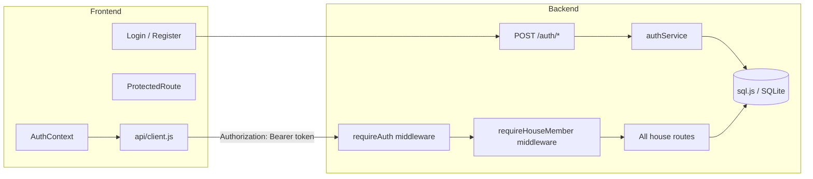
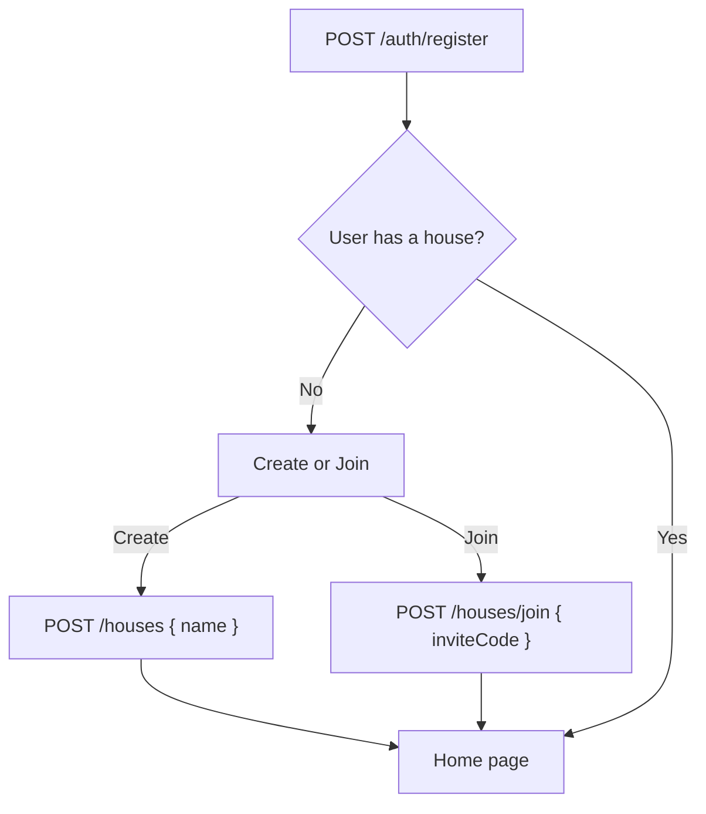

# Phase 2 — User Authentication Plan

## Architecture Overview



### Token Strategy

- **Access token:** JWT signed with `JWT_SECRET`, 15-minute TTL. Sent as `Authorization: Bearer <token>` on every request. Stored in React memory only (never localStorage).
- **Refresh token:** cryptographically random UUID stored in a `refresh_tokens` DB table, 7-day TTL. Sent to the client as an `httpOnly; SameSite=Strict; Secure` cookie. Used at `/auth/refresh` to issue a new access token without re-login.

This pattern means XSS cannot steal the refresh token, and CSRF cannot use it (SameSite=Strict + no state-mutating GET). The access token lives only in JS memory and is lost on page reload (triggering an automatic `/auth/refresh` on mount).

---

## 1. Database Changes

### New tables (migration `0001_add_auth.sql`)

- `**users**` — `id`, `email` (UNIQUE), `password_hash`, `display_name`, `created_at`
- `**refresh_tokens**` — `id`, `user_id` (FK → users, cascade delete), `token` (UNIQUE), `expires_at`, `created_at`
- `**houses**` — add `invite_code TEXT UNIQUE` (6-char random alphanumeric, used for joining)

### Schema changes in `backend/src/db/schema.js`

- Add `users` and `refreshTokens` table definitions
- Add `inviteCode` column to `houses`
- `household_members.userId` already exists (nullable) — will be populated on join

---

## 2. New Backend Dependencies

Add to `backend/package.json`:

- `jsonwebtoken` — JWT sign/verify
- `bcryptjs` — password hashing (pure JS; avoids native build issues)
- `cookie-parser` — parse httpOnly refresh token cookie

---

## 3. New Backend Files

### `backend/src/services/authService.js`

Business logic only, no Express:

- `register(email, password, displayName)` — hash password (bcrypt, cost 12), create user, generate and persist refresh token, return `{ user, accessToken, refreshToken }`
- `login(email, password)` — verify email exists, compare hash, issue tokens
- `logout(refreshToken)` — delete refresh token row
- `refresh(refreshToken)` — validate token exists and not expired, issue new access token
- `verifyAccessToken(token)` — synchronous JWT verify, returns payload or throws

### `backend/src/middleware/requireAuth.js`

Express middleware:

- Reads `Authorization: Bearer <token>` header
- Calls `authService.verifyAccessToken`
- On success: sets `req.user = { userId, email }` and calls `next()`
- On failure: returns `401 { error: 'Unauthorized' }`

### `backend/src/middleware/requireHouseMember.js`

Express middleware (runs after `requireAuth`):

- Queries `household_members WHERE house_id = req.params.houseId AND user_id = req.user.userId`
- On found: sets `req.member = member` and calls `next()`
- On not found: returns `403 { error: 'Forbidden' }`

### `backend/src/routes/auth.js`

Mounted at `/auth`:

| Method | Path        | Description                                                                                                                      |
| ------ | ----------- | -------------------------------------------------------------------------------------------------------------------------------- |
| POST   | `/register` | Create account. Body: `{ email, password, displayName }`. Returns: `{ data: { user, accessToken } }`. Sets refresh token cookie. |
| POST   | `/login`    | Authenticate. Body: `{ email, password }`. Returns: `{ data: { user, accessToken } }`. Sets refresh token cookie.                |
| POST   | `/logout`   | Clears refresh token from DB and cookie. Requires refresh token cookie.                                                          |
| POST   | `/refresh`  | Issues new access token from refresh token cookie. Returns `{ data: { accessToken } }`.                                          |
| GET    | `/me`       | Returns current user (requires `requireAuth`). Returns `{ data: { user } }`.                                                     |

---

## 4. Changes to Existing Backend Files

### `backend/src/routes/houses.js`

- Add `POST /houses` — authenticated, creates house with generated `inviteCode`, auto-creates a `household_member` row linking the creating user
- Add `POST /houses/join` — authenticated, accepts `{ inviteCode }`, creates `household_member` row
- `GET /houses` returns only houses the authenticated user belongs to
- `GET /houses/:houseId` protected by `requireAuth` + `requireHouseMember`

### All other house-scoped routers (choreTypes, members, assignments)

- Apply `requireAuth` then `requireHouseMember` to all routes in these files

### `backend/src/index.js`

- Mount `cookie-parser` middleware
- Mount `authRouter` at `/auth`
- `requireAuth` and `requireHouseMember` are applied per-router, not globally, so `/health` and `/auth/*` remain unprotected

### `backend/.env.example`

Add:

```
# JWT_SECRET=replace_with_a_random_256_bit_secret
# JWT_EXPIRES_IN=15m
# REFRESH_TOKEN_EXPIRES_DAYS=7
```

---

## 5. New Frontend Files

### `frontend/src/context/AuthContext.jsx`

React context + provider:

- State: `{ user, accessToken, activeHouseId, isLoading }`
- On mount: calls `api.refreshToken()` silently to restore session; on failure, stays logged out
- Exposes: `login(email, password)`, `register(email, password, displayName)`, `logout()`, `refreshHouses()`

### `frontend/src/hooks/useAuth.js`

Simple `useContext(AuthContext)` hook.

### `frontend/src/components/ProtectedRoute.jsx`

Wraps any route: if `user` is null and refresh has finished loading, redirects to `/login`.

---

## 6. Changes to Existing Frontend Files

### `frontend/src/api/client.js`

- Module-level `_accessToken` variable set by `AuthContext` via `setToken(token)`
- Add `Authorization: Bearer <token>` header when token is present
- On `401` response: call `POST /auth/refresh` (sends cookie), update stored token, retry the original request once
- New methods: `register`, `login`, `logout`, `refreshToken`, `me`, `createHouse`, `joinHouse`

### `frontend/src/App.jsx`

- Wrap app in `<AuthProvider>`
- Add `react-router-dom` routes: `/login`, `/register`, `/` (protected)

### `frontend/src/hooks/useHouse.js`

- Replace hard-coded `'default-house'` with `activeHouseId` from `AuthContext`

### `frontend/src/pages/Home.jsx`

- Renders `<HouseSetup>` when user has no active house (post-registration flow)

---

## 7. New Frontend Pages

### `frontend/src/pages/Login.jsx`

Email + password form. Calls `login()` from `useAuth`. On success, navigates to `/`. Shows field-level error messages.

### `frontend/src/pages/Register.jsx`

Email + password + display name form. Calls `register()` from `useAuth`. On success, shows the "create or join a house" step.

### `frontend/src/pages/HouseSetup.jsx`

Create/join house UI shown when user is authenticated but has no active house. Tabs between "Create" (name input) and "Join" (6-char invite code input).

---

## 8. House Flow After Registration



The invite code is shown on the house settings page (read from `GET /houses/:houseId`). Any house member can share it. Anyone with the code and an account can join via `POST /houses/join`.

---

## 9. Testing Plan

All new code follows the same testing pattern already established in Phase 1.

| Layer                           | New tests                                                                                                                                            |
| ------------------------------- | ---------------------------------------------------------------------------------------------------------------------------------------------------- |
| `authService` unit              | register (success, duplicate email), login (success, wrong password, user not found), logout, refresh (valid, expired, not found), verifyAccessToken |
| `requireAuth` middleware        | missing header, malformed token, expired token, valid token                                                                                          |
| `requireHouseMember` middleware | member found, not found (403), different house (403)                                                                                                 |
| `auth.js` routes                | all 5 endpoints, cookie set/clear, 400 validations                                                                                                   |
| `houses.js` route               | POST create house, POST join (valid code, invalid code)                                                                                              |
| `AuthContext`                   | login, logout, register, mount refresh                                                                                                               |
| `Login.jsx`, `Register.jsx`     | form submit, error display, redirect                                                                                                                 |
| `ProtectedRoute`                | redirects when not authed, renders children when authed                                                                                              |
| Update existing route tests     | add auth mock so `requireAuth` passes in tests                                                                                                       |

---

## 10. File Change Summary

**New files:**

- `backend/drizzle/0001_add_auth.sql`
- `backend/src/services/authService.js`
- `backend/src/middleware/requireAuth.js`
- `backend/src/middleware/requireHouseMember.js`
- `backend/src/routes/auth.js`
- `frontend/src/context/AuthContext.jsx`
- `frontend/src/hooks/useAuth.js`
- `frontend/src/components/ProtectedRoute.jsx`
- `frontend/src/pages/Login.jsx`
- `frontend/src/pages/Register.jsx`
- `frontend/src/pages/HouseSetup.jsx`

**Modified files:**

- `backend/src/db/schema.js` — add `users`, `refreshTokens`, `inviteCode` on `houses`
- `backend/src/routes/houses.js` — POST create, POST join, apply auth middleware
- `backend/src/routes/choreTypes.js` — apply auth middlewares
- `backend/src/routes/members.js` — apply auth middlewares
- `backend/src/routes/assignments.js` — apply auth middlewares
- `backend/src/index.js` — mount cookie-parser and auth router
- `backend/.env.example` — add JWT_SECRET, JWT_EXPIRES_IN, REFRESH_TOKEN_EXPIRES_DAYS
- `backend/package.json` — add jsonwebtoken, bcryptjs, cookie-parser
- `frontend/src/api/client.js` — add auth header, token refresh on 401, new auth methods
- `frontend/src/App.jsx` — add AuthProvider, react-router routes
- `frontend/src/hooks/useHouse.js` — derive houseId from auth context
- `frontend/src/pages/Home.jsx` — post-registration house setup flow
- `docs/api.md` — document new auth endpoints and house create/join
- `docs/data-model.md` — document users and refresh_tokens tables
